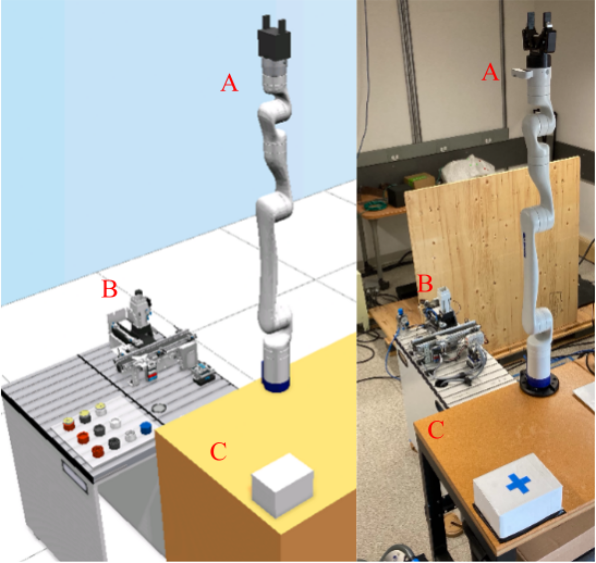
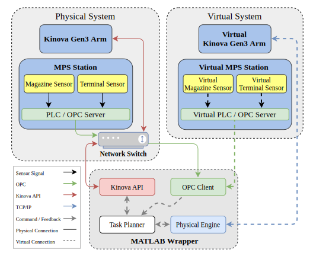

# Digital-Twinning Festo® CIROS with Physical Robot Models

A digital-twinning simulation platform for industrial manufacturing facilitated by:
- **MATLAB®** [Simulink](https://nl.mathworks.com/products/simulink.html)
- **Festo®** [CIROS simulation environment](https://www.festo.com/nl/nl/p/ciros-7-universeel-3d-simulatie-systeem-id_PROD_DID_8140772/?page=0)
- **Kinova®** [Gen3 robot](https://www.kinovarobotics.com/product/gen3-robots)
- **Festo®** [Modular Production System (MPS)](https://www.festo.com/us/en/e/technical-education/educational-concepts/highlights/learning-factories/mps-mechatronics-learning-factories-id_31963/)

**Authors:**

- **Ram Dershan** (ram.dershan@ubc.ca)
- **Amir M. Soufi Enayati** (amsoufi@uvic.ca)
- **Zengjie Zhang** (z.zhang3@tue.nl)

## Introduction

Simulation provides an efficient and safe evaluation solution for industrial automation to pretest software before deploying it in real systems. CIROS is a powerful simulation platform for creating and applying 3D models for automation technology. Enriched with didactic mechanisms and materials, CIROS can be used in a variety of ways in the learning environment. CIROS provides a wide variety of rendering models for common manufacturing devices, such as the Festo® Modular Production System (MPS) and Kinova® Gen3 robot (Fig. 1).


**Figure 1. the Kinova ® Gen3 robot (left) and the Festo® MPS (right).**

Nevertheless, CIROS does not provide inherent physical models for its simulation components, thus not capable of precisely characterizing the physical properties of industrial processes. Note that a high-fidelity simulation environment with precise physics characterization is critical for the transference of AI models to real hardware. This project aims at building up such a simulation environment for intelligent industrial manufacturing by extending the rendering models in CIROS with physical models of industrial components (Fig. 2). With the dynamic model of the robot integrated into a manufacturing digital-twining software, the platform achieves high simulation fidelity by incorporating the effect of the robot dynamics to the control logic of the industrial tasks. Also, the simulation can exchange data with the real robot via an open protocol, which enables the simultaneous test of the real and simulated systems (Fig. 3). This platform can be used for the development of AI algorithms guaranteeing easy access to rich industrial device libraries and smooth transitions of these algorithms.



**Figure 2. The extended CIROS simulation platform with digital-twinning extensions.**



**Figure 3. The structure and signal flow of the simulation platform.**

This project provides the MATLAB Wrapper as illustrated in Fig. 2. It communicates with the Kinova Gen3 robot using [Kinova MATLAB API](https://nl.mathworks.com/help/robotics/robotmanipulator/ug/connect-kinova-manipulate-arm.html) and with the Festo MPS using OPCOA protocol. For more details, please refer to our online publication:

**Zengjie Zhang**, **Ram Dershan**, **Amir M. Soufi Enayati**, **Marjan Yaghoubi**, **Dean Richert**, and **Homayoun Najjaran**. "A high-fidelity simulation platform for industrial manufacturing by incorporating robotic dynamics into an industrial simulation tool." *IEEE Robotics and Automation Letters*, vol. 7, no. 4, pp. 9123-9128, 2022, doi: [10.1109/LRA.2022.3190096](https://ieeexplore.ieee.org/document/9827559).

We are not providing the PLC programs for the Festo MPS and its virtual counterpart. Readers who are interested are encouraged to reproduce the program according to our [online publication](https://drive.google.com/file/d/1PTN0uLBG7EC9zxB3k6jkE5y8wFAzFNDz/view) and [online video](https://www.youtube.com/watch?v=7wK0cORfJzw&t=84s).


## System Requirements

Running this project requires all the following hardware and software components to be ready.

### Hardware

- **Kinova®** [Gen3 robot](https://www.kinovarobotics.com/product/gen3-robots)
  - IP address
  - Account and password
- **Festo®** [Modular Production System (MPS)](https://www.festo.com/us/en/e/technical-education/educational-concepts/highlights/learning-factories/mps-mechatronics-learning-factories-id_31963/)
  - OPCOA device IP address
  - OPCOA port
  - PLC program feeding and conveying small workpieces (refer to our [online publication](https://drive.google.com/file/d/1PTN0uLBG7EC9zxB3k6jkE5y8wFAzFNDz/view) for details).

### Software

- Windows 10/11 Operating System
- Licensed [Festo CIROS](https://www.festo.com/us/en/support-portal-specific/?query=ciros&productName=ciros&groupId=4&documentId=663178&documentTypeGroup=SOFTWARE&documentTypes=) software.
- Licensed MATLAB R2021a or newer, with the following add-ons installed
    - Simulink 2021a or newer
    - MATLAB Support for MinGW-w64 C/C++ Compiler
    - Robotics System Toolbox
    - [Robotics System Toolbox Support Package for KINOVA Gen3 Manipulators](https://nl.mathworks.com/help/robotics/robotmanipulator/ug/install-support-for-manipulator-hardware.html)
    - Simscape Multibody Toolbox
    - Industrial Communication Toolbox

### Network Connection

As illustrated in Fig. 2, the Kinova Gen3 robot, the MPS, and the computer running this MATLAB wrapper and the CIROS simulation software should be connected with a **common** network, typically via a high-bandwidth network switch. 


## Quick Guide

### File Structure

The project is organized according to the following structure
```
commons/                                        % Folder with useful m functions
libs/                                           % Folder with Simulink libraries
models/                                         % Folder with model and visualization files
    kinovaGen3_6DOF_V12.urdf                    % URDF model of the Kinova Gen3 robot
    kortex_description/                         % Rendering files of Kinova robot
    robotiq_arg85_description/                  % Rendering files of Robotiq gripper
setup_kinovaGen3_real_joint_space.m             % Main setup script with joint-space set points
setup_kinovaGen3_real_cartesian.m               % Main setup script with Cartesian-space set points
log_opc.m                                       % Helpful script to log OPC messages
README.md                                       % This ReadMe file
```

The modeling files in folder `models` are adapted from the [Kinova ros_kortex](https://github.com/Kinovarobotics/ros_kortex) GitHub repo. 

Now, the URDF model of a Kinova Gen3 robot can be directly loaded by the `loadrobot()` function. Check [source1](https://nl.mathworks.com/help/robotics/ref/loadrobot.html) and [source2](https://nl.mathworks.com/help/robotics/robotmanipulator/ug/get-latest-urdf.html).


### Quick Run

- Make sure all hardware is deployed, all software is installed, and the network is properly configured, as mentioned above.
- Make sure the PLC of the Festo MPS is programmed to load and convey cylinder workpieces. Please check out our [online publication](https://drive.google.com/file/d/1PTN0uLBG7EC9zxB3k6jkE5y8wFAzFNDz/view) for reproducing the PLC program which is not included in this project.
- Select one script between `setup_kinovaGen3_real_joint_space.m` and `setup_kinovaGen3_real_cartesian.m`.
- Update the IP address of the Kinova robot and your credentials:
    ```
    gen3Kinova.ip_address = 'XXX.XXX.XXX.XXX';
    gen3Kinova.user = 'XXX';
    gen3Kinova.password = 'XXX';
    ```
- Update the OPCUA IP address and communication port of the Festo MPS:
    ```
    uaClient = opcua('XXX.XXX.XXX.XXX', XXXX);
    ```
- Run the script. 
- `setup_kinovaGen3_real_joint_space.m` provides additional visualized robot motion enabled by the MATLAB Robotics System Toolbox, while `setup_kinovaGen3_real_cartesian.m` does not provide visualization.
- If successful, you should be able to see the robot performing the pick-and-place motion similar to that addressed in our [online publication](https://drive.google.com/file/d/1PTN0uLBG7EC9zxB3k6jkE5y8wFAzFNDz/view) and [online video](https://www.youtube.com/watch?v=7wK0cORfJzw&t=84s).
